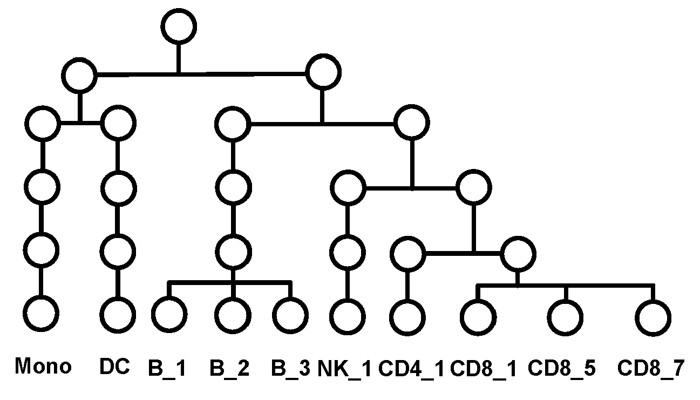

$\textbf{Hi}erarchical \ \ \textbf{Decon}volution \ \ (\textbf{HiDecon)}$
is a cellular deconvolution method that uses single-cell RNA sequencing
references and a hierarchical cell type tree, which models the
similarities among cell types and cell differentiation relationships, to
estimate cellular fractions in bulk data. HiDecon has outstanding
performance on estimating related cell types as well as rare cell types.

## Reference
Penghui Huang, Manqi Cai, Xinghua Lu, Chris McKennan, and Jiebiao Wang.
Accurate estimation of rare cell type fractions from tissue omics data via hierarchical deconvolution.
[Annals of Applied Statistics](https://www.e-publications.org/ims/submission/AOAS/user/submissionFile/59581?confirm=57fbf5a8).

## Installation

``` r
if (!"devtools" %in% rownames(installed.packages())) {
  install.packages('devtools')
}

# install the HiDecon R package
library(devtools)
if (!"HiDecon" %in% rownames(installed.packages())) {
  install_github('randel/HiDecon')
}


# load
library(HiDecon)
```

## Examples

In this part, we will show how to use HiDecon package using example data
in the package.

### Hierarchical tree and the cell type mapping matrix

Hierarchical tree is specified from well-studied cell lineages or can be
learned from hierarchical clustering of scRNA-seq data. The hierarchical
tree used to guide the deconvolution of example data is shown as below:

<figure>

<figcaption aria-hidden="true">Hierarchical tree constructed from cell
lineage relationship and used to guide HiDecon.</figcaption>
</figure>

### Example data

- bulk.dat: Gene by sample matrix. Simulated bulk tissue data of 126
  samples and 1572 genes. CPM normalized.

- ref.dat: Gene by cell matrix. This single cell reference used has 100
  cells and 1572 genes. CPM normalized.

- ref.type: Cell type labels of the single cell data ref.dat.

- B: List of the same length of the hierarchical tree. It contains cell
  type mapping matrices from layer 0 to 1 and L-1 to L.

- order.type: the cell type order of bottom layer of the given
  hierarchical tree.

``` r
data("B", "bulk.dat", "order.type", "ref.dat", "ref.type", package = "HiDecon")
```

### HiDecon using $\lambda$ selected by the tuning parameter selection algorithm

By default (argument ‘normalized= F’), HiDecon takes raw counts data
(both bulk and single cell) as input. Data normalization and
transformation (log_2 (CPM+1)) will be performed
automatically in the function.

We will show the usage of function with CPM normalized data (argument
‘normalized= T’).

``` r
## With normalized data as input
select.res <- select_HiDecon(bulk = bulk.dat, ref = ref.dat, B =B, cell_type = ref.type, type_order = order.type, normalized = T)
```

Check $\lambda$ chosen by tuning parameter selection method and the mCCC
on different &lambda;s.

``` r
select.res$lambda
#> [1] 40
round(select.res$mCCC,3)
#>    10    20    30    40    50    60    70    80    90   100   110   120   130 
#> 0.869 0.888 0.896 0.897 0.894 0.889 0.884 0.879 0.874 0.870 0.865 0.861 0.857 
#>   140   150   160   170   180   190   200 
#> 0.853 0.850 0.846 0.843 0.840 0.837 0.834
```

Check cellular fraction estimates.

``` r
round(head(select.res$res),3)
#>          Mono    DC   B_1   B_2 B_3  NK_1 CD4_1 CD8_1 CD8_5 CD8_7
#> sample1 0.490 0.011 0.148 0.037   0 0.000 0.003 0.140 0.172 0.000
#> sample2 0.546 0.113 0.000 0.033   0 0.000 0.000 0.110 0.000 0.198
#> sample3 0.477 0.024 0.000 0.110   0 0.050 0.034 0.196 0.000 0.108
#> sample4 0.438 0.044 0.098 0.042   0 0.000 0.022 0.136 0.181 0.039
#> sample5 0.399 0.000 0.150 0.000   0 0.000 0.065 0.257 0.000 0.130
#> sample6 0.537 0.000 0.039 0.080   0 0.081 0.034 0.004 0.000 0.224
```

### HiDecon using prespecified $\lambda$

While we suggest users use select_HiDecon, users can run HiDecon with
prespecified $\lambda$.

``` r
example.res <- HiDecon(bulk = bulk.dat, ref = ref.dat, B = B, cell_type = ref.type, type_order = order.type,
                    lambda = 40)
```
